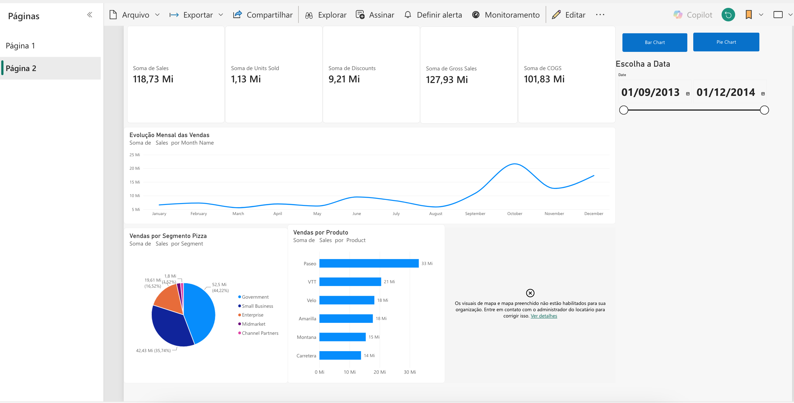

# 📊 Desafio 02 — Relatório de Vendas com Power BI

## 📌 Sobre o Projeto

Projeto desenvolvido como parte da **Formação Power BI Analyst da DIO**, com o objetivo de construir um relatório interativo para análise de vendas e indicadores financeiros.

O relatório foi desenvolvido utilizando o **Power BI Online**, permitindo explorar recursos de visualização, segmentação de dados e navegação interativa.

## 📈 Funcionalidades Implementadas

- Indicadores de vendas, unidades vendidas, descontos, vendas brutas e custos (COGS).
- Gráfico de evolução mensal das vendas.
- Análise de vendas por segmento.
- Análise de vendas por produto.
- Botões interativos para alternar entre gráficos de barras e pizza.
- Segmentação de dados por período.
- Configuração de visualização geográfica por país.

## ⚠️ Limitação Técnica — Permissão para Mapas

Durante o desenvolvimento do relatório, foi realizada a configuração do visual de mapa utilizando os campos **Country** e **Sales**.

Entretanto, ao tentar visualizar o mapa, o Power BI Online apresentou a seguinte mensagem:

> "Os visuais de mapa e mapa preenchido não estão habilitados para sua organização. Entre em contato com o administrador do locatário para corrigir isso."

Essa restrição está relacionada às configurações administrativas do ambiente Power BI utilizado, não sendo possível habilitar o recurso diretamente pelo editor do relatório.

Por esse motivo, o espaço destinado ao mapa foi mantido no dashboard com a mensagem de erro, demonstrando a tentativa de implementação do recurso solicitado.

## 🖥️ Visualização do Dashboard

## 🛠️ Ferramentas Utilizadas

- Microsoft Power BI Online
- Power BI Service
- Dataset Financial Sample
- GitHub para documentação e publicação do projeto

## 🎯 Resultado

O desafio permitiu aplicar conceitos de visualização de dados, criação de indicadores, interatividade entre gráficos e utilização de filtros dinâmicos.

As funcionalidades principais foram implementadas, com exceção da exibição do mapa, limitada pelas permissões administrativas do ambiente utilizado.
