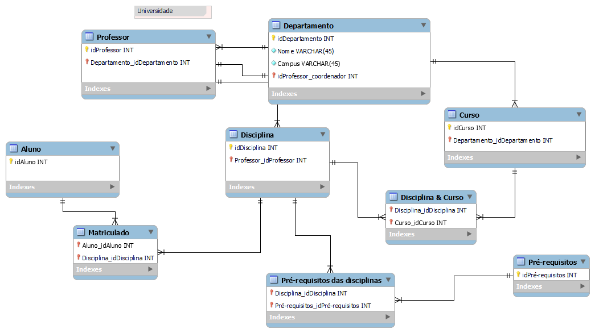

# Desafio 04 — Modelagem Dimensional: Star Schema

## Objetivo

Desenvolver um modelo dimensional no formato Star Schema (esquema estrela), utilizando como referência o diagrama relacional de uma universidade, disponibilizado na formação Power BI Analyst da DIO.

O foco da modelagem é a análise das atividades dos professores, considerando suas relações com disciplinas, cursos, departamentos e períodos de oferta.

## Ferramenta utilizada

- diagrams.net (draw.io) — criação do diagrama dimensional.

## Estrutura do modelo

O modelo desenvolvido contém uma tabela fato central e cinco tabelas dimensão.

### Tabela fato — Fato_Oferta

Representa as ofertas de disciplinas ministradas por professores.

**Granularidade:** cada registro corresponde a uma oferta de disciplina, associada a um professor, curso, departamento e data.

Campos:
- idOferta (PK)
- idProfessor (FK)
- idDepartamento (FK)
- idCurso (FK)
- idDisciplina (FK)
- idData (FK)
- quantidadeOfertas

### Tabelas dimensão

**Dim_Professor**
- idProfessor (PK)

**Dim_Departamento**
- idDepartamento (PK)
- nomeDepartamento
- campus
- idProfessorCoordenador

**Dim_Curso**
- idCurso (PK)

**Dim_Disciplina**
- idDisciplina (PK)

**Dim_Data**
- idData (PK)
- dataOferta
- dia
- mes
- trimestre
- ano

## Relacionamentos

Todas as dimensões possuem relacionamentos de cardinalidade 1:N com a tabela Fato_Oferta.

Essa estrutura permite analisar a quantidade de ofertas por professor, departamento, curso, disciplina e período.

## Premissas da modelagem

O diagrama relacional original não apresenta registros específicos de ofertas nem informações temporais.

Por esse motivo, a tabela Fato_Oferta e os atributos temporais foram propostos para fins de modelagem conceitual, considerando a possibilidade de acesso a dados adicionais, conforme previsto no enunciado do desafio.

Não foram incluídas informações sobre alunos ou matrículas, respeitando o escopo estabelecido.

## Diagrama dimensional

## Arquivos do projeto

- [Diagrama dimensional — PNG](Star_Schema_Professores.png)
- [Diagrama editável — draw.io](Star_Schema_Professores.drawio)

## Resultado

Foi desenvolvido um diagrama dimensional em esquema estrela, com uma tabela fato, cinco dimensões e relacionamentos 1:N.

O projeto demonstra a aplicação dos conceitos de modelagem dimensional para análise das atividades docentes.

**Status:** Diagrama dimensional concluído. Implementação física e carga de dados não realizadas.
