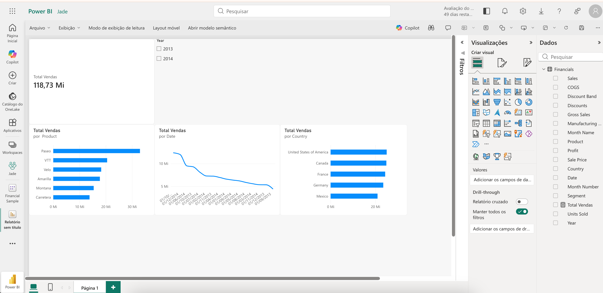

# 📊 Dashboard Financeiro com Power BI

Dashboard desenvolvido no Power BI para análise de dados financeiros e visualização dos principais indicadores de vendas.

## 📌 Dashboard

## 🎯 Objetivo

O objetivo deste projeto foi desenvolver um relatório interativo capaz de transformar dados financeiros em informações visuais que facilitem a análise e a tomada de decisão.

## 📊 Análises desenvolvidas

O dashboard apresenta:

- 💰 Total de vendas
- 📦 Vendas por produto
- 🌎 Vendas por país
- 📈 Evolução das vendas ao longo do tempo
- 📅 Filtro interativo por ano

## 🔎 Principais possibilidades de análise

Com o relatório é possível:

- Identificar os produtos com maior volume de vendas;
- Comparar o desempenho das vendas entre países;
- Acompanhar a evolução das vendas ao longo do período;
- Filtrar os resultados por ano.

## 🛠️ Tecnologias utilizadas

- Microsoft Power BI
- Power BI Service
- Microsoft Financial Sample
- GitHub

## 📚 Aprendizados

Durante o desenvolvimento deste projeto foram praticados conceitos de:

- Exploração de dados;
- Criação de indicadores;
- Construção de visualizações;
- Análise temporal;
- Uso de filtros interativos;
- Organização de dashboards;
- Apresentação de informações para apoio à tomada de decisão.

## 🚀 Resultado

O resultado é um dashboard financeiro interativo que reúne indicadores e diferentes perspectivas de análise em uma única página.

---

**Desenvolvido por Jaqueline Araújo**
